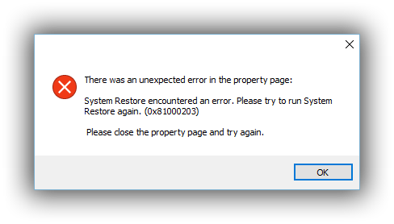

# SBP: A Programming Paradigm for Building Secure Software and Operating Systems

SBP: Selector-based programming, is a programming paradigm for building secure software.

- SBP makes it easy to secure your code
- SBP helps you organize code by thinking in terms of namespaces and APIs
- SBP makes code inter-operable with other languages, more future-proof, and more portable
- SBP replaces the need for OOP in many situations
- SBP is inspired by message-passing (ObjC/Smalltalk/etc) and comes with all of the benefits that message-passing architectures afford
- SBP embraces the LISP idea that `code = data` and gives you all of the benefits and possibilities that affords
- SBP makes it easier to debug and understand your code
- SBP makes it possible to create architectures that are remarkably flexible, clean, and safe; this comes from the benefits described above

> "SBP always makes me excited." — Alex Jin

> "I wish I knew about this when I first started programming." — Greg Slepak

### Installing

Installing and using SBP is easy.

```
$ npm install -S @sbp/sbp
```

Import the `sbp` function wherever you want to use it:

```js
import sbp from '@sbp/sbp'

sbp('sbp/selectors/register', {
  'my-domain/my-great-selector': function (name) {
    console.log(`hello ${name}!`)
  }
})

// call your selector from anywhere in the project
sbp('my-domain/my-great-selector', 'jill') // prints "hello jill!"
```

SBP is **tiny** (about 80 lines, unminified) and has zero dependencies.

The core `sbp` function is only about 12 lines, and yet the impact of these 12 lines is profound.

### Core Resources

- :book: **[SBP Core API](docs/sbp-api.md)**
- :book: **[SBP-based libraries](docs/libraries.md)**
- :book: **[Apps written using SBP](docs/apps.md)**
- :book: **[SBP Language Support](docs/language-support.md)**

See also **[SBP Features](#sbp-features)** below.

### Quick Examples

In SBP everything works based on selectors. A selector is a string composed of two parts: a _domain_ and an _action_. For example, in `'okTurtles.data/set'`, the domain is `okTurtles.data` and the action is `/set`.
The first argument of `sbp()` is always a registered selector and the rest of the arguments are parameters to the function assigned to the selector.

```
sbp(selector, ...args)
```

You can think about it as calling a normal function, but with more advantages. One of them is to access any selector from anywhere in the project by just importing `sbp` itself.

```js
// Using SBP:
import sbp from '@sbp/sbp'

// - call any selector registered
sbp('okTurtles.data/set', { login: true })
sbp('okTurtles.events/emit', 'CLOSE_MODAL')
```

```js
// Using standard functions:

// - import each function individually
import okTurtlesDataSet from 'path/to/method/data-set.js'
import okTurtlesEventsEmit from 'path/to/method/events-emit.js'

okTurtlesDataSet({ login: true })
okTurtlesEventsEmit('CLOSE_MODAL')
```

There are many more things you can do with SBP.

Some of them are described below under **[SBP Features](#sbp-features)**.

More details about SBP can be found in the **[Core Resources](#core-resources)** above.

### Backstory

One day I was sitting at a table, wondering how I would go about implementing a secure operating system (as one does).

I sat, and sat, and sat some more, trying to peer into the *essence* of what security *means*.

And then it hit me: the reason why computers are so insecure - is because *we do not understand them.*

We do not understand what they're doing, and specifically, what they're supposed to be doing.

**The activity that takes place within a computer is decoupled from the _description_ of that activity, and this can lead to unexpected behavior.**

Security is all about the computer doing what you expect it to do, and not something else.

To know what to expect from a computer, we need to know what they're being told to do. When something happens inside of a computer, the *low-level* developer-facing description of what is happening comes in the form of unreadable, incomprehensible symbols and numbers. To make matters worse these symbols and numbers often change. That is how it's written, and is how it's compiled, that is what appears in system log messages, that is what developer tools show to us, and in some cases, even to users.



What happens inside of any of today's operating systems is a *complete mystery* that has to be unraveled using special tools and special insider knowledge. When something goes wrong, we often don't even notice it. And when we do, something has usually gone wrong multiple times, in multiple areas, and it requires the skills of a professional computer detective to figure out what exactly happened.

Most of the time we don't bother. That's how complicated it is. Most of the time, the official advice is to "reinstall". "Format". Turn it off and on again and hope for the best.

This is not how computers should work.

What has been missing from computers is a *direct link* between human thought, intention, and activity.

This is where the idea of SBP sprang from, and with it, an entirely new way of writing computer software.

### Problems With Modern Software Programming Paradigms

Writing software today is like building a home where the walls and rooms and floors are constantly shifting.

We can have, for example, an object:

```js
const obj = {}
```

And we can do whatever we want with it.

```js
// we can pass it to another function
foo(obj)

// and inside that function, we can give it another name
function foo (bar) {
  // and give it a new property
  bar.baz = 5
}

// and then finally, we can "compile" it, and it is no longer "obj" or "bar"
$ npm run dist

// it is now a$09weuf0fjf, and our function "foo" is f$2083ujsf0j in one file,
// and f$j098f0esfhj in another file
```

If we want to know what happens in our system when code like this gets run, we have no idea. There's some process, doing something, and we can't be sure what it is that it's doing. The process could have loaded a dynamically linked library that modified its behavior. Even if it didn't, the code itself is written in a way that allows anything to happen. There's surprisingly little structure, even when we add type checking systems. In the end, the code that is produced calls low-level system calls.

We can place restrictions on the allowed system calls. Indeed, that's what things like SELinux try to do. But SELinux doesn't tell us what the program is doing. SELinux doesn't tell us what the kernel is doing. And when implemented correctly, SELinux often breaks software, causing system administrators to disable it entirely or barely use its potential.

We humans do not think in terms of programming languages as we go about our day. We think in terms of spoken and written languages like English.

These languages are surprisingly vague, and it is often the case that misunderstandings occur with them. However, they are how *we* think. We find it much easier to describe in English what we want from our programs, *because* of how vague and non-specific these languages are. We can describe in general terms what we expect our code to do.

Wouldn't it be great if these *English intensions* were somehow represented at the very lowest level of our operating systems?

If we could peer into an operating system and see, instead of hexidecimals and symbols like `rs_stired`, `_0x`, `1 ???  (in logd)  load address 0x1006c8000 + 0xef40  [0x1006d6f40]`, we could see exactly what it _intended to do_ at any given moment, in something resembling English? It would become trivial to monitor a program, and restrict its behavior at a granular level.

### SBP: Selector-based Programming

Selector-based Programming is about writing all of our software this way.

We take a human intention and convert it into a human-readable string that contains the following information:

- The context that we're dealing with, often containing information about the who is doing something and what they are doing. We call this the **domain** of the selector.
- The very specific intention that is being executed. We call this the **action** of the selector. In most cases, we don't talk about the selector's action, as the selector itself - the entire thing, containing both the domain and the action, can be thought of as the action being performed. So really, the action is the selector.

You've probably seen SBP before, but just didn't realize you were dealing with it.

[RESTful APIs](https://en.wikipedia.org/wiki/Representational_state_transfer) are a kind of a SBP.

In JavaScript, strings are usually represented with single quotes, so an SBP selector in JavaScript would look like this: `'<domain>/<action>'`

#### Core SBP Selectors

SBP comes with the following predefined core selectors:

- `'sbp/selectors/register'`
- `'sbp/selectors/unregister'`
- `'sbp/selectors/overwrite'`
- `'sbp/selectors/fn'`
- `'sbp/selectors/unsafe'`
- `'sbp/selectors/lock'`
- `'sbp/domains/lock'`
- `'sbp/filters/global/add'`
- `'sbp/filters/domain/add'`
- `'sbp/filters/selector/add'`

Since most languages use either single or double-quotes to define strings, most SBP selectors look the same no matter what programming language they're written in. English is assumed to be the language the selectors are written in, as most software is written in English, but it doesn't have to be. It's recommended though, because this makes it possible to understand computers no matter where in the world you live, as long as you understand English.

- :book: **[SBP Core API](docs/sbp-api.md)**

### SBP Features

SBP is very simple, and because of that, it is extraordinarily powerful.

Here are things you can do with SBP:

- Anything

But seriously, you can do stuff with SBP that you couldn't really do in the language you were using. Specifically, it is uncommon to be able to trivially:

- Serialize computation for later use. Usually this requires a special programming language (like LISP), or a cumbersome library. With SBP, you get it for free.

- Create a firewall for networking, and low-level (or high-level) sandboxing.

- You can create a programming language using SBP since everything imaginable can be represented as a string. For example, here we define the primitive JavaScript operator `if` using SBP in JavaScript:

  ```js
  sbp('sbp/selectors/register', {
    'if': function (condition, aBlock, bBlock) {
      condition ? aBlock() : bBlock()
    }
  })
  ```

  We can now perform conditional function calls using SBP:

  ```js
  sbp('if', 4 > 5, doThis, doThat) // calls doThat()
  ```

  We can instead make it use selectors entirely, so that we can save a series of computations to disk or send them over the network using JSON:

  ```js
  sbp('sbp/selectors/register', {
    'if': function (selCond, selA, selB) {
      return sbp(selCond) ? sbp(selA) : sbp(selB)
    },
    // similar selectors registered for 'for', 'printOK', etc..
  })
  
  const computations = [
    ['if', 'serivce/running', 'printOK', 'handleServiceDown']
  ]
  
  sbp('computations/run', computations)
  ```

  In SBP, just like in LISP, "code = data", and "data = code".

- We can monitor everything our server is doing in real time, with 3 lines of code:

  ```js
  sbp('sbp/filters/global/add', (domain, selector, data) => {
    console.debug(`[sbp] ${selector}`, data)
  })
  ```

  Now, everything our server does gets logged to the console, without our having to add any debug logging ourselves.

- We can create sophisticated APIs that represent anything in reality, even a remote machine on an Internet located on a different planet:

  ```js
  sbp('sbp/selectors/register', {
    'planets/vorgon/internet/ipv4': function (ipAddress) { ... },
    'planets/earth/internet/ipv4': function (ipAddress) { ... },
  })
  ```

  Now, we can differentiate between two different Internets, and monitor our application using these selectors whenever it connects to IP address `1.2.3.4` on Earth or planet Vorgon.

- We can do something much more down-to-Earth, like design our entire app in terms of human-readable APIs that call each other, and won't change on us in the future. Once these strings are defined, that's it, they're usually defined for life, and even if they change, because the strings are so long, the semantic intention behind them is preserved across time, without name conflicts. Once the APIs have been defined, it becomes a much easier task to fill in the implementation. Instead of thinking about types, or classes, or objects, we think about what we want the program to do — in English — write that, and then worry about the details.

## History

See [HISTORY.md](HISTORY.md).

## License

[MIT](LICENSE.txt).
